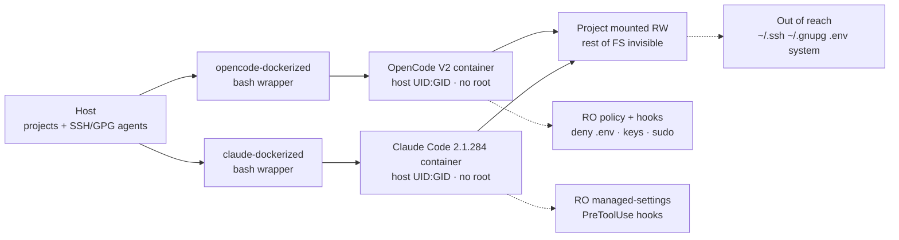

I use AI agents to write code every day. OpenCode for some projects, Claude Code for others. They are good at their jobs, but one thing about them bothered me more and more. Each one installed whatever it wanted on my machine, touched whatever it wanted on my disk, and piled up Python, Node with TypeScript, Rust and Go dependencies straight into my environment. My system was turning into the dumping ground for their experiments.

The last straw was realizing two things at once. First, an agent with full access to my `$HOME` can read my SSH keys, my `.env` files with tokens and my private configs without me noticing. Second, uninstalling what they leave behind is nearly impossible. Whose stray `node_modules` is that? Who owns that `venv`? Did I put that binary in `~/.local/bin`, or did the agent?

So I did what I always do when a tool I need does not exist. I built it. Two projects that isolate each agent in its own Docker container, with strictly limited access to my host and my files, giving up none of their capabilities. [opencode-dockerized](https://github.com/yukiteruamano/opencode-dockerized) and [claude-dockerized](https://github.com/yukiteruamano/claude-dockerized).

## How my environment was getting polluted

The problem was never one single incident. It was slow everyday erosion. I asked Claude Code to add a Python dependency to a project and ended up with `pip` installing user-level packages that later broke another tool. I asked OpenCode to try a Node project and a 400 MB `node_modules` nobody cleans appeared. Rust left `rustup` toolchains I never asked for. Go filled `~/go/pkg/mod` with modules from projects that no longer even exist.

Every ecosystem has its own manager with its own opinion about where things should live. `uv` is fast but creates its `.venv` wherever you tell it, or wherever it feels like. `pnpm` and `npm` argue about `node_modules`. `cargo` downloads half of crates.io into `~/.cargo`. Each is manageable alone. Added together, and multiplied by two autonomous agents running commands without asking twice, the result is a system I no longer control.

Then there is the serious part. A coding agent needs to read your project, run commands and sometimes reach the network. That means, by default, it can also read `~/.ssh/id_ed25519`, snoop on `~/.npmrc` with your tokens, dump your environment with a plain `env` or wipe your home with a misdirected `rm -rf .`. I am not saying they do it out of malice. I am saying the blast radius of a mistake is your entire machine. That felt unacceptable for a tool I run dozens of times a day.

I tried the obvious fixes before building anything. Read-only permissions here, a separate user there, careful `sudo`. All of it was fragile. Each agent has its own config system, its own plugins and its own ways around restrictions that are not well designed. I needed something systematic. A box with real walls.

## Why Docker instead of a lighter jail

The honest comparison is not against version managers. A `venv`, an `nvm` or a `rustup` are tools for coexistence: they organize dependencies, they contain nothing. The agent still sees your whole disk. The comparison that matters is against systems that actually isolate.

The first is the classic `chroot`. It changes the filesystem root a process sees and little else. It needs root to set up, it isolates neither PID nor network nor mounts, and it carries decades of documented escapes. For an agent running arbitrary commands it is a "do not enter" sign, not a wall.

The second one is serious: `bubblewrap`. Unprivileged namespaces, read-only binds, seccomp, no daemon and less overhead than Docker. If all I wanted was to run one contained throwaway command, `bwrap` would win. I say it plainly because the honest alternative strengthens the decision instead of weakening it.

I chose Docker for everything around the runtime, not for the runtime. A `bwrap` jail isolates a process; it does not version environments, cache layers, share images across machines or manage persistent state. I needed that more than minimalism: the same rebuildable box on any host, with configuration, authentication and sessions living outside the disposable box. That is what the wrappers implement, and rewriting it on top of `bwrap` would have meant reinventing half of Docker to save myself the daemon.

And on the daemon, the nuance that closes the debate. The classic case against Docker is its privileged component. But in this design the agent never touches its socket: it is not mounted except as an explicit opt-in, documented as equivalent to root on the host. No socket, no escalation to the daemon. I pay the daemon's price on the host; the agent does not even know it exists. I chose operational boredom over minimalism.

The classic price of Docker is friction. Hand-made volume mounts, file permission fights, lost authentication on every restart, reconfiguring MCP and plugins every time. That is exactly what my two wrappers eliminate. One command to build, one to authenticate, one to work. All state persists on the host under a single versionable directory. The box is disposable, the state is not.

```sh
# Install (once)
curl -fsSL https://raw.githubusercontent.com/yukiteruamano/opencode-dockerized/master/install.sh | bash
opencode-dockerized build
opencode-dockerized auth

# Work (every day, from any directory)
opencode-dockerized run
opencode-dockerized run ~/projects/my-app
```

## The design in one diagram

Both projects share the same architecture. A wrapper script on the host prepares minimal mounts, injects the security policy and starts the container as my own user. The agent lives inside and only sees its project.



If you read this without JavaScript, the idea in one sentence is this. The host only exposes the project directory read-write, plus the agent configuration read-only. Secrets travel through an env file with `docker --env-file`, never on the command line. SSH and GPG agents are forwarded by socket so you can sign commits and clone over SSH without private keys ever entering the container. The host Docker socket is not mounted unless you explicitly ask, because it equals root on the host.

| Mount                | Mode       | Purpose                                       |
| -------------------- | ---------- | --------------------------------------------- |
| Project directory    | Read-write | The only thing the agent may change           |
| Agent configuration  | Read-only  | MCP, models, rules; edited on the host        |
| State and sessions   | Read-write | Auth, history and sessions survive rebuilds   |
| SSH/GPG agent socket | Forwarded  | Git over SSH and signing with no exposed keys |
| Docker socket        | Opt-in     | Only with `setting.docker_socket=true`        |

## claude-dockerized under the hood

[claude-dockerized](https://github.com/yukiteruamano/claude-dockerized) wraps the native Claude Code binary, version-pinned (`2.1.284` at the time of writing), in a slim Debian image with Node, `uv` for Python and basic tools. No `sudo`, no agent-writable global npm. The image is not the interesting part. The security layer the wrapper generates on the host before every run is.

Claude Code has a native policy system that I respect instead of fighting. The wrapper generates `managed-settings.json` and mounts it at `/etc/claude-code/`, the highest-precedence settings source. That is where `permissions.deny` and `permissions.ask`, the bypass-mode ban and the autoupdater kill-switch go. Since that path is read-only inside the container, neither your user settings nor project settings can relax it. Your preferences (`/model`, `/config`) stay writable because they live on a different mount. Security without losing comfort.

On top sit the native `PreToolUse` hooks. Two versioned scripts evaluate every Bash command and every file access against two pattern sets, with three selectable modes. `balanced` is the default and drops the noisy cloud false positives while keeping everything dangerous. `strict` enforces it all. `none` keeps only the built-in backstops. And the backstops are serious on their own. References to `.env` (except `.env.example`), `*.pem`, `*.key`, `auth.json`, `.npmrc`, `.mcp-auth`, `.ssh`, SSH keys and private GnuPG material are denied through shell and file tools alike. Bare environment dumps (`env`, `printenv` with no arguments), `ssh-keygen -y` and host-agent control (`ssh-add -D`) are blocked in every mode too.

Two details I especially like. First, updates are signed. `claude-dockerized update` only applies releases signed with keys you pinned yourself via `update --trust-key`, shows the diff before applying and keeps the previous image around for `rollback`. Second, after every session the wrapper fingerprints the persistent paths where a session could plant code (git hooks, plugins, local binaries) and logs it to `audit/sessions.jsonl`. `doctor` shows the latest entry. Healthy, auditable paranoia.

```sh
claude-dockerized build            # build the image
claude-dockerized auth            # login (persists on host, mode 0600)
claude-dockerized run ~/my-project
claude-dockerized exec "Explain this repo"
claude-dockerized update --check  # 0 up to date, 100 update out, 1 error
claude-dockerized doctor          # host + container diagnostics
```

## opencode-dockerized under the hood

[opencode-dockerized](https://github.com/yukiteruamano/opencode-dockerized) is a fork of `glennvdv/opencode-dockerized` rebuilt around OpenCode V2, with its native `permissions` system and plugin hooks. Same core idea, adapted to how OpenCode loads configuration.

The trick here is `OPENCODE_CONFIG_CONTENT`. Permission rules are read on the host and passed inline as an environment variable, never from a writable file inside the container. A session cannot relax its own rules because there is no file to edit. The real config tree lives self-contained under `~/.config/opencode-dockerized/home/` and mounts read-only, with the versioned guard (`plugins/security-guard.js`) and the inherited `opencode-policy` patterns mirrored inside. All state (auth, sessions, caches) survives restarts and rebuilds because it lives on the host.

The threat model matches its sibling. Container as your UID and GID, no `sudo` binary, no capabilities, no Docker socket by default. Mounting whole `~/.ssh` or `~/.gnupg` is refused by the wrapper. Only the agent socket plus read-only `config` and `known_hosts` are shared, and for GPG the restricted `S.gpg-agent.extra` socket is preferred with no silent fallback to the full socket. Secrets go in `setting.env_file` via `docker --env-file`, and the wrapper aborts on inline secrets in `opencode.json`. `DRY_RUN` output is redacted so you can inspect the full `docker run` without leaking anything.

Daily ergonomics match too. A `doctor` command diagnosing guard, agents, websearch provider and env file. `config sync` refreshing the versioned security layer and merging your custom rules. Git worktree support, container resource limits and a contract test suite covering mounts, permissions and policies.

```sh
opencode-dockerized build
opencode-dockerized auth
opencode-dockerized run ~/my-project
DRY_RUN=true opencode-dockerized run ~/my-project  # inspect the docker run
opencode-dockerized doctor
opencode-dockerized config sync --check  # read-only, CI-friendly
```

## What stays outside the container

Being explicit about limits matters, because a box that overpromises is worse than none. This is not a kernel jail. The container uses host networking by default for convenience, so a determined malicious agent could exfiltrate over the network what it already sees. What it cannot see is almost everything, and that is what matters for daily use. `claude-dockerized` also offers a `hardening=strict` profile with a read-only root filesystem and bridged networking if you want more.

Nor is it a replacement for caution. I still review what they do, especially with permissive tool settings. What changed is the scale of possible mistakes. Before, a misread `rm -rf .` could take my home with it. Now it only affects the mounted project. Before, a careless `pip install` polluted my system. Now it pollutes a container I rebuild in a minute. The blast radius went from everything to nearly nothing.

| Without Docker                                    | With Docker                           |
| ------------------------------------------------- | ------------------------------------- |
| `rm -rf .` can wipe your home                     | Only affects the mounted project      |
| Python, Node, Rust and Go deps on your system     | They live inside the disposable image |
| The agent reads `~/.ssh`, `.env` files and tokens | Those paths do not exist for it       |
| `sudo` and escalation available                   | No sudo, no caps, no new privileges   |
| Manual cleanup is hopeless                        | Rebuild and clean state               |

## The blast radius, measured

I have worked this way for weeks and I am not going back. My host is clean for the first time in years. Projects build the same, tests run the same, git signs the same, MCP servers answer the same. The only difference I notice is the absence of surprises. No ghost `node_modules`, no toolchains I never asked for, no fear when the agent says it is about to run commands.

The trick is not one wall but five layers turning unbounded failures into bounded, reversible ones. First, minimal mounts: the container only sees the project read-write, so a misread `rm -rf .` hurts one directory, not your home. Second, immutable policy: the security configuration travels read-only or inline, so not even a compromised session can relax its own rules. Third, no escalation by construction: no `sudo`, no capabilities, `no-new-privileges` — a mistake never climbs to root. Fourth, out-of-band secrets: they travel in an env file, never on the command line, and references to `.env`, SSH keys or tokens are denied through shell and file tools alike, while SSH and GPG agents forward without keys ever entering. Fifth, traceability: post-session fingerprints, persistent audit and signed updates with rollback. Each layer answers an accident I already lived through or watched up close.

A mistake inside the box costs a one-minute rebuild; the same mistake outside costs an afternoon of cleanup or a leaked token. That is why it pays off: it does not eliminate failures, it puts a ceiling and an exit door on them.

If you use OpenCode or Claude Code daily, try them. The code is open under MIT, setup takes minutes and the first `run` inside the box feels exactly like outside. With one difference. When you are done, your machine is still yours.

Isolate, verify, keep shipping.
