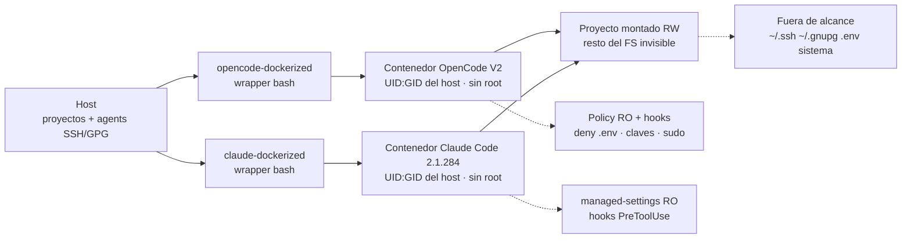

Uso agentes de IA para programar todos los días. OpenCode para unos proyectos, Claude Code para otros. Son buenos en lo suyo, pero tenían un problema que me molestaba cada vez más. Cada uno instalaba lo que quería en mi máquina, tocaba lo que quería en mi disco y acumulaba dependencias de Python, Node con TypeScript, Rust y Go directamente en mi entorno. Mi sistema se estaba convirtiendo en el vertedero de sus experimentos.

La gota que colmó el vaso fue darme cuenta de dos cosas a la vez. Primera, que un agente con acceso total a mi `$HOME` puede leer mis claves SSH, mis `.env` con tokens y mis configuraciones privadas sin que yo me entere. Segunda, que desinstalar lo que dejan atrás es casi imposible. ¿Qué era ese `node_modules` suelto? ¿Ese `venv` de quién era? ¿Ese binario en `~/.local/bin` lo puse yo o lo puso el agente?

Así que hice lo que hago siempre que una herramienta me falta. La construí. Dos proyectos que aíslan a cada agente en su propio contenedor Docker, con acceso estrictamente limitado a mi host y a mis archivos, sin renunciar a ninguna de sus capacidades. [opencode-dockerized](https://github.com/yukiteruamano/opencode-dockerized) y [claude-dockerized](https://github.com/yukiteruamano/claude-dockerized).

## Mi entorno se estaba ensuciando

El problema no era un incidente concreto. Era la erosión lenta de todos los días. Le pedía a Claude Code que añadiera una dependencia Python a un proyecto y terminaba con `pip` instalando paquetes a nivel de usuario que luego rompían otra herramienta. Le pedía a OpenCode que probara un proyecto Node y aparecía un `node_modules` de 400 MB que nadie limpiaba. Rust dejaba toolchains de `rustup` que yo no había pedido. Go llenaba `~/go/pkg/mod` con módulos de proyectos que ya ni existían.

Cada ecosistema tiene su propio gestor y su propia idea de dónde deben vivir las cosas. `uv` es rápido pero crea sus `.venv` donde le dices, o donde le parece. `pnpm` y `npm` discuten sobre `node_modules`. `cargo` descarga medio crates.io en `~/.cargo`. Por separado son manejables. Sumados, y multiplicados por dos agentes autónomos que ejecutan comandos sin preguntar dos veces, el resultado es un sistema que ya no controlo.

Y luego está lo serio. Un agente de codificación necesita leer tu proyecto, ejecutar comandos y a veces acceder a la red. Eso significa que, por defecto, también puede leer `~/.ssh/id_ed25519`, husmear en `~/.npmrc` con tus tokens, volcar tus variables de entorno con un simple `env` o borrar tu home con un `rm -rf .` mal dirigido. No digo que lo hagan por malicia. Digo que el radio de explosión de un error es toda tu máquina. Eso me parecía inaceptable para una herramienta que ejecuto decenas de veces al día.

Probé las soluciones obvias antes de construir nada. Permisos de solo lectura aquí, un usuario aparte allá, `sudo` con cuidado. Todo era frágil. Cada agente tiene su propio sistema de configuración, sus propios plugins y sus propias formas de saltarse las restricciones si no están bien diseñadas. Necesitaba algo sistemático. Una caja con paredes de verdad.

## Por qué Docker y no una jaula más ligera

La comparación honesta no es contra gestores de versiones. Un `venv`, un `nvm` o un `rustup` son herramientas de convivencia: ordenan dependencias, no contienen nada. El agente sigue viendo tu disco entero. La comparación que importa es contra sistemas que sí aíslan.

El primero es el clásico `chroot`. Cambia la raíz del filesystem que ve un proceso y poco más. Necesita root para montarse, no aísla PID ni red ni montajes, y acumula décadas de escapes documentados. Para un agente que ejecuta comandos arbitrarios es un cartel de "no pasar", no una pared.

El segundo es serio: `bubblewrap`. Namespaces sin privilegios, binds de solo lectura, seccomp, sin demonio y con menos sobrecarga que Docker. Si lo único que quisiera fuera ejecutar un comando suelto y contenido, `bwrap` ganaría. Lo digo sin rodeos porque la alternativa honesta refuerza la decisión en vez de debilitarla.

Elegí Docker por todo lo que rodea al runtime, no por el runtime. Una jaula `bwrap` aísla un proceso; no versiona entornos, no cachea capas, no comparte imágenes entre máquinas ni gestiona estado persistente. Yo necesitaba eso más que minimalismo: la misma caja reconstruible en cualquier host, con la configuración, la autenticación y las sesiones viviendo fuera de la caja desechable. Eso es lo que implementan los wrappers, y reescribirlo sobre `bwrap` habría sido reinventar medio Docker para ahorrarme el demonio.

Y sobre el demonio, el matiz que cierra el debate. El argumento clásico contra Docker es su componente privilegiado. Pero en este diseño el agente nunca toca su socket: no se monta salvo opt-in explícito, documentado como equivalente a root en el host. Sin socket no hay escalada al demonio. El precio del demonio lo pago yo en el host; el agente ni siquiera sabe que existe. Elegí aburrimiento operativo sobre minimalismo.

El precio clásico de Docker es la fricción. Montar volúmenes a mano, pelear con permisos de archivos, perder la autenticación en cada reinicio, reconfigurar MCP y plugins cada vez. Eso es exactamente lo que mis dos wrappers eliminan. Un comando para construir, un comando para autenticar, un comando para trabajar. Todo el estado persiste en el host bajo un solo directorio versionable. La caja es desechable, el estado no.

```sh
# Instalar (una vez)
curl -fsSL https://raw.githubusercontent.com/yukiteruamano/opencode-dockerized/master/install.sh | bash
opencode-dockerized build
opencode-dockerized auth

# Trabajar (cada día, desde cualquier directorio)
opencode-dockerized run
opencode-dockerized run ~/proyectos/mi-app
```

## El diseño en un diagrama

Los dos proyectos comparten la misma arquitectura. Un script wrapper en el host prepara montajes mínimos, inyecta la política de seguridad y arranca el contenedor como mi propio usuario. El agente vive dentro y solo ve su proyecto.



Si lees el diagrama sin JavaScript, la idea en una frase es esta. El host solo expone el directorio del proyecto en lectura y escritura, más la configuración del agente en solo lectura. Los secretos viajan por fichero de entorno con `docker --env-file`, nunca en la línea de comandos. Los agentes SSH y GPG se reenvían por socket para firmar commits y clonar por SSH sin que las claves privadas entren jamás al contenedor. El socket de Docker del host no se monta salvo que lo pidas explícitamente, porque equivale a root en el host.

| Montaje                   | Modo                | Para qué                                       |
| ------------------------- | ------------------- | ---------------------------------------------- |
| Directorio del proyecto   | Lectura y escritura | Lo único que el agente puede modificar         |
| Configuración del agente  | Solo lectura        | MCP, modelos, reglas; se edita en el host      |
| Estado y sesiones         | Lectura y escritura | Auth, historial y sesiones sobreviven rebuilds |
| Socket del agente SSH/GPG | Reenvío             | Git por SSH y firmas sin exponer claves        |
| Socket de Docker          | Opt-in              | Solo con `setting.docker_socket=true`          |

## claude-dockerized bajo el capó

[claude-dockerized](https://github.com/yukiteruamano/claude-dockerized) encierra el binario nativo de Claude Code, con versión pinneada (`2.1.284` en el momento de escribir esto), en una imagen Debian slim con Node, `uv` para Python y herramientas básicas. Nada de `sudo`, nada de npm global escribible por el agente. Lo interesante no es la imagen, es la capa de seguridad que el wrapper genera en el host antes de cada ejecución.

Claude Code tiene un sistema nativo de políticas que respeto en vez de pelearme con él. El wrapper genera `managed-settings.json` y lo monta en `/etc/claude-code/`, que es la fuente de configuración de mayor precedencia. Ahí van los `permissions.deny` y `permissions.ask`, la prohibición de modos bypass y la desactivación del autoupdater. Como esa ruta es de solo lectura dentro del contenedor, ni tu configuración de usuario ni la del proyecto pueden relajarla. Tus preferencias (`/model`, `/config`) siguen siendo escribibles porque viven en otro montaje. Seguridad sin perder comodidad.

Encima van los hooks nativos `PreToolUse`. Dos scripts versionados en el repo evalúan cada comando Bash y cada acceso a archivos contra dos conjuntos de patrones, con tres modos seleccionables. `balanced` es el defecto y elimina los falsos positivos ruidosos de entornos cloud manteniendo todo lo peligroso. `strict` lo aplica todo. `none` deja solo las barreras base. Y las barreras base son serias por sí solas. Referencias a `.env` (salvo `.env.example`), `*.pem`, `*.key`, `auth.json`, `.npmrc`, `.mcp-auth`, `.ssh`, claves SSH y material privado de GnuPG se deniegan tanto por shell como por herramientas de archivo. Los volcados de entorno desnudos (`env`, `printenv` sin argumentos), `ssh-keygen -y` y el control del agente del host (`ssh-add -D`) también están bloqueados en todos los modos.

Dos detalles que me gustan especialmente. Primero, las actualizaciones están firmadas. `claude-dockerized update` solo aplica releases firmados con claves que tú mismo fijaste con `update --trust-key`, muestra el diff antes de aplicar y guarda la imagen anterior para `rollback`. Segundo, después de cada sesión el wrapper compara huellas de las rutas persistentes donde una sesión podría plantar código (hooks de git, plugins, binarios locales) y lo registra en `audit/sessions.jsonl`. `doctor` te muestra la última entrada. Paranoia sana y auditable.

```sh
claude-dockerized build            # construye la imagen
claude-dockerized auth            # login (persiste en el host, modo 0600)
claude-dockerized run ~/mi-proyecto
claude-dockerized exec "Explica este repo"
claude-dockerized update --check  # 0 al día, 100 hay update, 1 error
claude-dockerized doctor          # diagnóstico host + contenedor
```

## opencode-dockerized bajo el capó

[opencode-dockerized](https://github.com/yukiteruamano/opencode-dockerized) es un fork de `glennvdv/opencode-dockerized` reconstruido alrededor de OpenCode V2, con su sistema nativo de `permissions` y hooks de plugin. La idea central es la misma, adaptada a cómo OpenCode carga su configuración.

Aquí la jugada es `OPENCODE_CONFIG_CONTENT`. Las reglas de permiso se leen en el host y se pasan inline como variable de entorno, nunca desde un fichero escribible dentro del contenedor. La sesión no puede relajar sus propias reglas porque no hay archivo que editar. El árbol de configuración real vive autocontenido en `~/.config/opencode-dockerized/home/` y se monta en solo lectura, con el guard versionado (`plugins/security-guard.js`) y los patrones heredados de `opencode-policy` reflejados dentro. Todo el estado (auth, sesiones, cachés) sobrevive a reinicios y rebuilds porque vive en el host.

El modelo de amenazas es el mismo que en el hermano. Contenedor como tu UID y GID, sin binario `sudo`, sin capacidades, sin Docker socket por defecto. Montar `~/.ssh` o `~/.gnupg` enteros está prohibido por el wrapper. Solo se comparte el socket del agente más `config` y `known_hosts` en solo lectura, y para GPG se prefiere el socket restringido `S.gpg-agent.extra` sin fallback silencioso al socket completo. Los secretos van en `setting.env_file` con `docker --env-file` y el wrapper aborta si encuentra secretos inline en `opencode.json`. Hay redacción en modo `DRY_RUN` para que puedas inspeccionar el `docker run` completo sin filtrar nada.

Y para el día a día trae lo mismo. Comando `doctor` que diagnostica guard, agentes, proveedor de búsqueda web y fichero de entorno. `config sync` que refresca la capa de seguridad versionada y fusiona tus reglas personalizadas. Soporte de worktrees de git, límites de recursos del contenedor y una suite de tests de contrato que cubre montajes, permisos y políticas.

```sh
opencode-dockerized build
opencode-dockerized auth
opencode-dockerized run ~/mi-proyecto
DRY_RUN=true opencode-dockerized run ~/mi-proyecto  # inspecciona el docker run
opencode-dockerized doctor
opencode-dockerized config sync --check  # solo lectura, apto para CI
```

## Qué se queda fuera del contenedor

Merece la pena ser explícito sobre los límites, porque una caja que promete demasiado es peor que ninguna. Esto no es una cárcel de kernel. El contenedor usa la red del host por defecto por comodidad, así que un agente malicioso determinado podría exfiltrar por red lo que ya ve. Lo que no ve es casi todo, y eso es lo que importa para el uso diario. En `claude-dockerized` existe además el perfil `hardening=strict` con rootfs de solo lectura y red en bridge si quieres más.

Tampoco es un sustituto de la cautela. Sigo revisando lo que hacen, especialmente con herramientas permisivas. Lo que cambió es la escala del error posible. Antes, un `rm -rf .` mal interpretado podía llevarse mi home. Ahora solo afecta al proyecto montado. Antes, un `pip install` descuidado contaminaba mi sistema. Ahora contamina un contenedor que reconstruyo en un minuto. El radio de explosión pasó de todo a casi nada.

| Sin Docker                                    | Con Docker                                 |
| --------------------------------------------- | ------------------------------------------ |
| `rm -rf .` puede borrar tu home               | Solo afecta al proyecto montado            |
| Deps de Python, Node, Rust y Go en tu sistema | Viven dentro de la imagen desechable       |
| El agente lee `~/.ssh`, `.env` y tokens       | Esos paths no existen para él              |
| `sudo` y escaladas disponibles                | Sin sudo, sin caps, sin nuevos privilegios |
| Limpieza manual imposible                     | Rebuild y estado limpio                    |

## El radio de explosión, medido

Llevo semanas trabajando así y no vuelvo atrás. Mi host está limpio por primera vez en años. Los proyectos compilan igual, los tests corren igual, el git firma igual y los MCP responden igual. La única diferencia que noto es la ausencia de sorpresas. No hay `node_modules` fantasma, no hay toolchains que no pedí, no hay miedo cuando el agente dice que va a ejecutar comandos.

El truco no es una sola pared, son cinco capas que convierten fallos no acotados en fallos acotados y reversibles. Primera, montajes mínimos: el contenedor solo ve el proyecto en lectura y escritura, así que un `rm -rf .` mal interpretado duele en un directorio, no en tu home. Segunda, política inmutable: la configuración de seguridad viaja en solo lectura o inline, de modo que ni siquiera una sesión comprometida puede relajar sus propias reglas. Tercera, sin escalada por construcción: sin `sudo`, sin capacidades y con `no-new-privileges`, un error nunca sube a root. Cuarta, secretos fuera de banda: viajan en fichero de entorno, nunca en la línea de comandos, y las referencias a `.env`, claves SSH o tokens se deniegan por shell y por herramientas a la vez; los agentes SSH y GPG se reenvían sin que las llaves entren jamás. Quinta, trazabilidad: huellas post-sesión, auditoría persistente y actualizaciones firmadas con rollback. Cada capa responde a un accidente que ya viví o que vi de cerca.

Un error dentro de la caja cuesta un rebuild de un minuto; el mismo error fuera cuesta una tarde de limpieza o un token filtrado. Por eso compensa: no elimina los fallos, les pone techo y puerta de salida.

Si usas OpenCode o Claude Code a diario, pruébalos. El código es abierto bajo MIT, la instalación lleva minutos y el primer `run` dentro de la caja se siente igual que fuera. Con una diferencia. Cuando terminas, tu máquina sigue siendo tuya.

Aísla, verifica y sigue programando.
